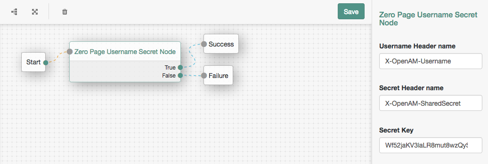

<!--
 * The contents of this file are subject to the terms of the Common Development and
 * Distribution License (the License). You may not use this file except in compliance with the
 * License.
 *
 * You can obtain a copy of the License at legal/CDDLv1.0.txt. See the License for the
 * specific language governing permission and limitations under the License.
 *
 * When distributing Covered Software, include this CDDL Header Notice in each file and include
 * the License file at legal/CDDLv1.0.txt. If applicable, add the following below the CDDL
 * Header, with the fields enclosed by brackets [] replaced by your own identifying
 * information: "Portions copyright [year] [name of copyright owner]".
 *
 * Copyright 2017 ForgeRock AS.
-->
<b>Zero-Page Username & Shared Secret Authentication Node</b>
<br/>
An authentication node which accepts a username and shared secret. Authentication succeeds if the user exists in the user datastore and the shared secret matches the configured value. This node may be useful in situations where authentication is handled by an external third-party service, but a corresponding SSO session is also needed for the user.
<br/>
<br/>
<b>Installation</b>
<br/>
Copy the .jar file from the ../target directory into the ../web-container/webapps/openam/WEB-INF/lib directory where AM is deployed.  Restart the web container to pick up the new node.  The node will then appear in the authentication trees components palette.
<br/>
<br/>
<b>Usage</b>
<br/>
Create an authentication tree incorporating this node, configure the names of headers in which the username and shared secret values are passed, and configure the shared secret value.
<br/>
Since this node is zero-page, it can be called using only headers and no callbacks. For example:
<br/>
```
curl -X POST -H "X-OpenAM-Username: demo" -H "X-OpenAM-SharedSecret: Wf52jaKV3lawzQySFc0YfQwuDRKjsv0LC" 'http://openam.frdpcloud.com:8080/openam/json/authenticate?authIndexType=service&authIndexValue=Example'
```
<br/>
<br/>
<b>To Build</b>
<br/>
Edit the necessary ZeroPageUsernameSecretNode.java as appropriate.  To rebuild, run "mvn clean install" in the directory containing the pom.xml
<br/>
<br/>
<br/>

<br/>
<br/>
<b>Disclaimer</b>
The sample code described herein is provided on an "as is" basis, without warranty of any kind, to the fullest extent permitted by law. ForgeRock does not warrant or guarantee the individual success developers may have in implementing the sample code on their development platforms or in production configurations.

ForgeRock does not warrant, guarantee or make any representations regarding the use, results of use, accuracy, timeliness or completeness of any data or information relating to the sample code. ForgeRock disclaims all warranties, expressed or implied, and in particular, disclaims all warranties of merchantability, and warranties related to the code, or any service or software related thereto.

ForgeRock shall not be liable for any direct, indirect or consequential damages or costs of any type arising out of any action taken by you or others related to the sample code.